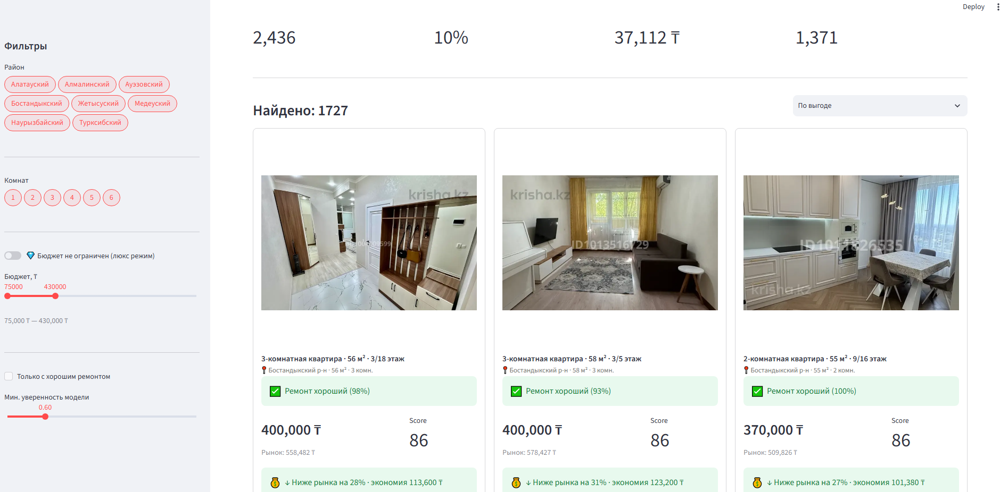

# 🏠 Krisha Analytics

AI-инструмент для поиска недооценённых квартир на рынке аренды/продажи недвижимости Казахстана (krisha.kz).

## Что делает проект

Приложение анализирует объявления о недвижимости и находит квартиры с **хорошим ремонтом по цене ниже рынка**:

-  Собирает данные с krisha.kz через веб-парсинг
-  Оценивает качество ремонта по фотографиям через компьютерное зрение (CLIP + XGBoost)
-  Сравнивает цену с рыночной по району, комнатности и ценовому сегменту
-  Показывает топ выгодных предложений в интерактивном веб-приложении

## Как это работает

```
1. parser_pg.py      → собирает объявления с krisha.kz в PostgreSQL
2. labeling.py        → ручная разметка обучающей выборки (GOOD/BAD ремонт)
3. train_model_v4.py  → обучение модели: CLIP (embeddings) + XGBoost (классификация)
4. predict.py         → применение модели ко всем объявлениям в базе
5. app_v3.py           → Streamlit-приложение для поиска и фильтрации
```

## Модель

- **Точность: 87%** на отложенной выборке
- Признаки: embeddings изображений от CLIP (openai/clip-vit-base-patch32)
- Классификатор: XGBoost с подбором гиперпараметров через GridSearchCV
- Обучающая выборка: 400+ вручную размеченных квартир

## Стек

`Python` · `PostgreSQL` · `BeautifulSoup` · `PyTorch` · `Transformers (CLIP)` · `XGBoost` · `scikit-learn` · `Pandas` · `Streamlit`

## Скриншот



## Запуск

```bash
pip install -r requirements.txt

# Создай .env файл с настройками базы данных:
# DB_HOST=localhost
# DB_PORT=5432
# DB_NAME=krisha
# DB_USER=postgres
# DB_PASSWORD=your_password

python -m streamlit run app_v3.py
```

## Автор

Пет-проект для практики Data Analysis / ML.
